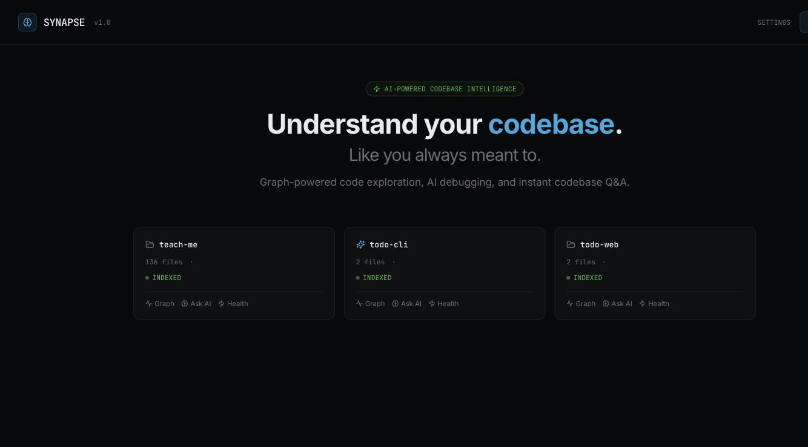
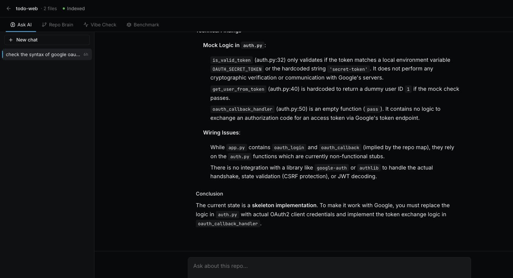
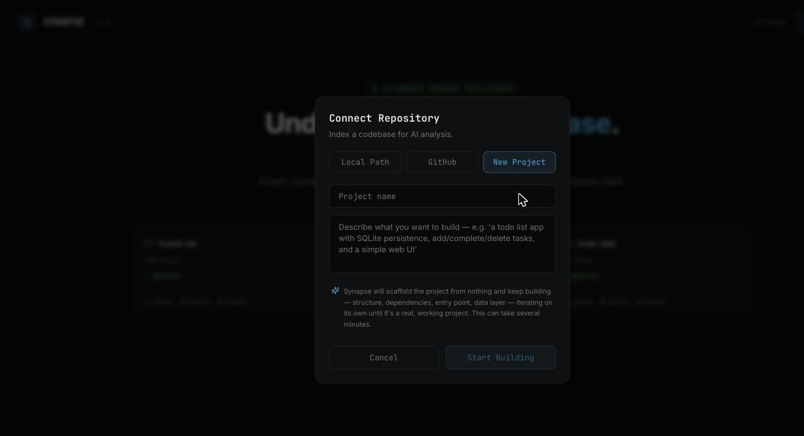
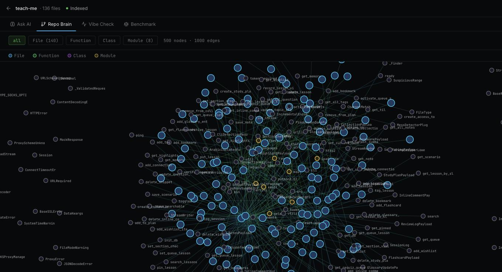
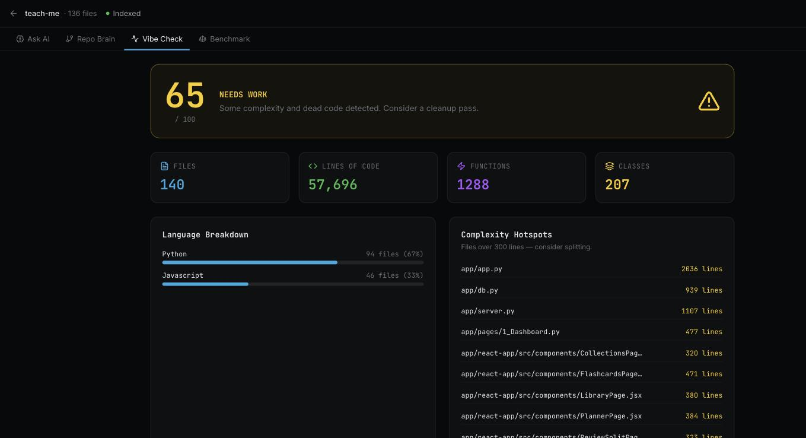

# Synapse

AI-powered codebase intelligence. Connect a repo — or start one from nothing — and get graph-grounded answers, debugging, code review, and safe autonomous edits, not just a grep-and-hope chatbot.



## What makes it different

Every piece of context that reaches the LLM comes from a real Neo4j call graph, not raw text chunks. Qdrant only resolves *which* symbols are relevant (as UIDs); Neo4j supplies the actual structure — signatures, callers, callees, entrypoints — that gets serialized into the prompt. Ask it to check whether something is "wired in properly" and it reads the real files the graph resolved, then answers with file:line citations instead of guessing.



## Features

- **Ask AI** — a single chat box for QA, debugging, code review, and implementation. It classifies read vs. write intent itself, asks a clarifying question instead of guessing when a request is genuinely ambiguous, and streams progress step-by-step as it plans, writes, and applies file changes.
- **Start from nothing** — no local repo or GitHub URL required. Describe what you want built and Synapse scaffolds and iteratively builds a real, runnable project on its own, with the same task-by-task progress view as a normal chat turn.

  
- **Repo Brain** — interactive Neo4j-backed call graph explorer.

  
- **Vibe Check** — a code health dashboard backed by real graph queries (true call-graph fan-in for dead-code detection, not a string-matching heuristic).

  
- **Commit History Chat** — talk to your git history.
- **Model Benchmarker** — compare two LLM providers side by side on the same query.
- **Bring Your Own Model** — plug in OpenAI, Anthropic, vLLM, sglang, or Ollama. Credentials are encrypted at rest.
- **Session persistence** — every conversation is saved and resumable; switching or starting a new chat never loses history.
- **In-app file editor** — open any file the agent touched (or any file at all) in a side-by-side console and edit it directly.

## Quick Start

```bash
docker compose up --build
```

Open [http://localhost:3000](http://localhost:3000)

For local dev conveniences (e.g. mounting your own repos), copy settings into a
gitignored `docker-compose.override.yml` rather than editing the committed compose
file.

## Testing

```bash
cd backend && pip install -r requirements.txt && pytest tests/ -v
```

CI runs the same suite on every push/PR via `.github/workflows/backend-tests.yml`.

## Stack

- **Frontend**: Next.js 14, TailwindCSS, D3.js, CodeMirror
- **Backend**: FastAPI, LangGraph
- **Graph DB**: Neo4j
- **Vector DB**: Qdrant
- **Parsing**: Python AST (full call-graph resolution); lightweight regex-based parsing for JS/TS
